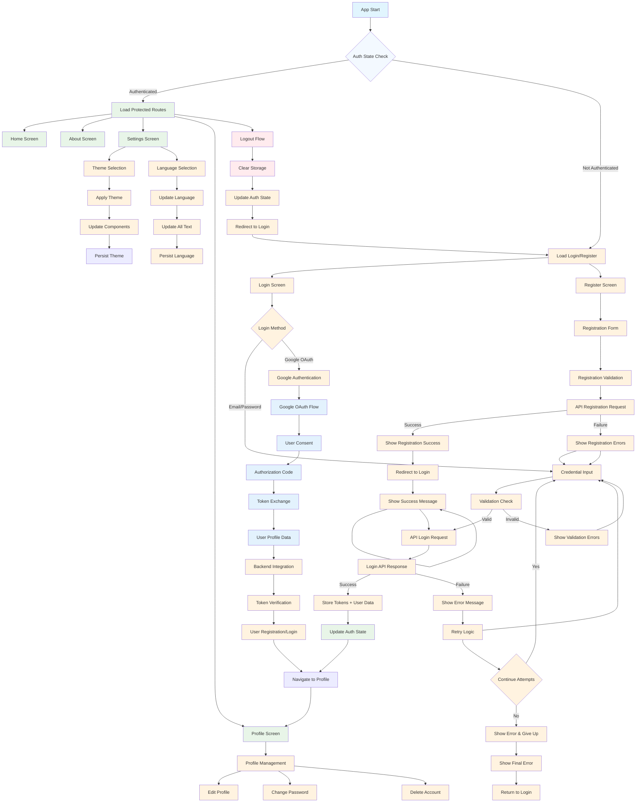
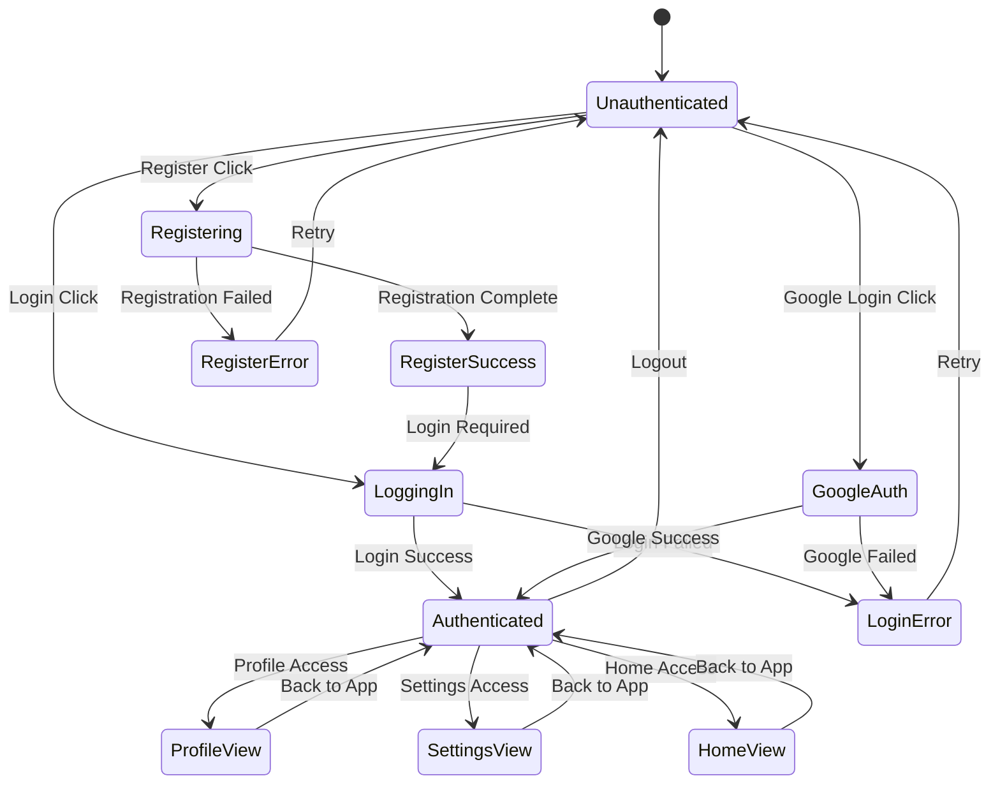
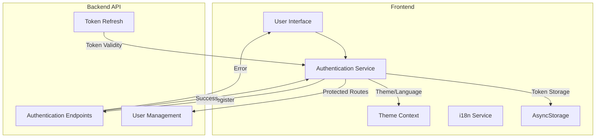
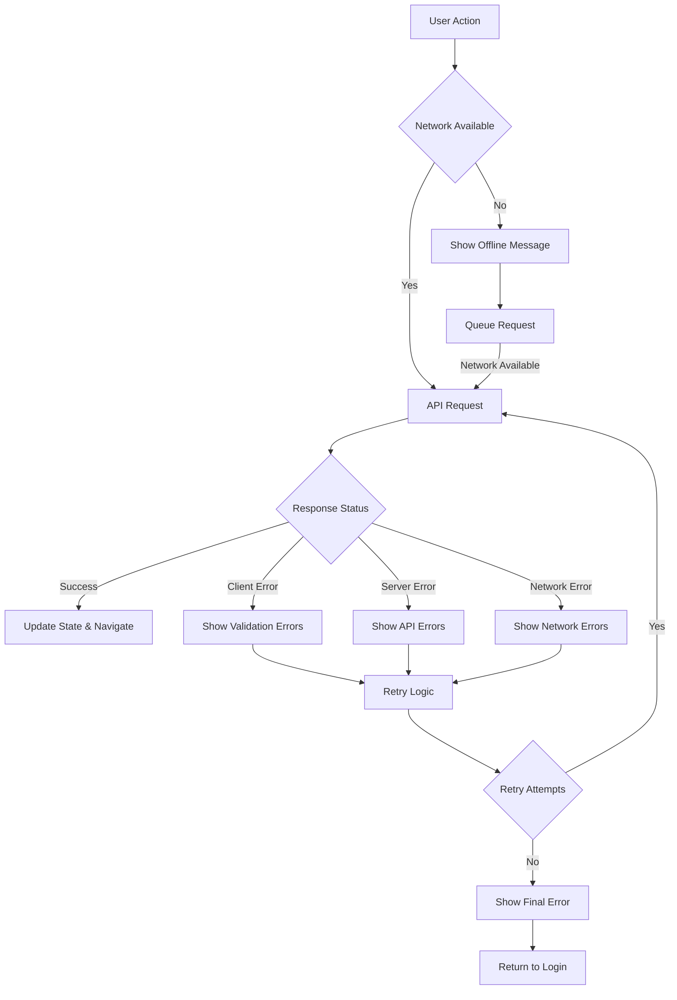
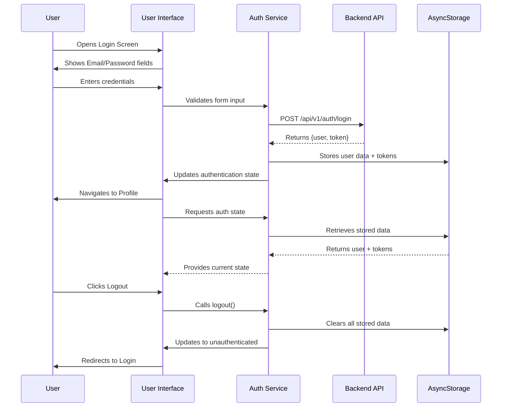

# Application Flow Chart

## Mermaid Flowchart

### Complete Application Flow



### User Journey State Machines

#### Authentication State Machine



### Navigation Flow

```mermaid
graph LR
    subgraph Authentication Routes
        Login[Login Screen]
        Register[Register Screen]
    end

    subgraph Protected Routes
        Home[Home Screen]
        Profile[Profile Screen]
        Settings[Settings Screen]
        About[About Screen]
    end

    Login -->|Login Success| Protected Routes
    Register -->|Register Success| Protected Routes

    Protected Routes -->|Logout| Authentication Routes
```

### Data Flow Architecture



### Error Handling Flow



### Component Interaction Flow



## Key Decision Points

### 1. Authentication Decisions
- **Route Protection**: Check auth state before allowing protected route access
- **Token Validity**: Validate token expiration and refresh if needed
- **Method Selection**: Choose between email/password and Google OAuth
- **Error Recovery**: Retry logic with exponential backoff

### 2. Navigation Decisions
- **Deep Linking**: Handle URL-based navigation to specific routes
- **Tab vs Stack**: Use appropriate navigator for content type
- **Authentication Flow**: Separate auth flows from main app navigation
- **State-Based Routing**: Dynamic route rendering based on auth state

### 3. Data Management Decisions
- **Persistence Strategy**: What data to store locally vs fetch from API
- **Cache Invalidation**: When to clear cached data
- **Offline Support**: What functionality to provide without network
- **Sync Strategy**: When and how to sync data with backend

### 4. User Experience Decisions
- **Loading States**: Where to show loading indicators
- **Error Messages**: How to present errors to users
- **Success Feedback**: How to confirm successful actions
- **Progressive Enhancement**: Load features progressively for better performance

## Flow Optimization Strategies

### 1. Route Preloading
- Preload critical routes in background
- Cache route components for faster navigation
- Implement skeleton screens for better perceived performance

### 2. State Management
- Minimize re-renders with proper state design
- Use memoization for expensive calculations
- Implement proper cleanup in useEffect hooks

### 3. Network Optimization
- Implement request deduplication
- Cache frequently accessed data
- Use connection pooling for API requests

### 4. Error Recovery
- Implement automatic retry logic
- Provide offline fallbacks
- Graceful degradation for network issues

This flowchart documentation provides a comprehensive visual and textual representation of how the application handles user interactions, data flows, and state management throughout the user journey.